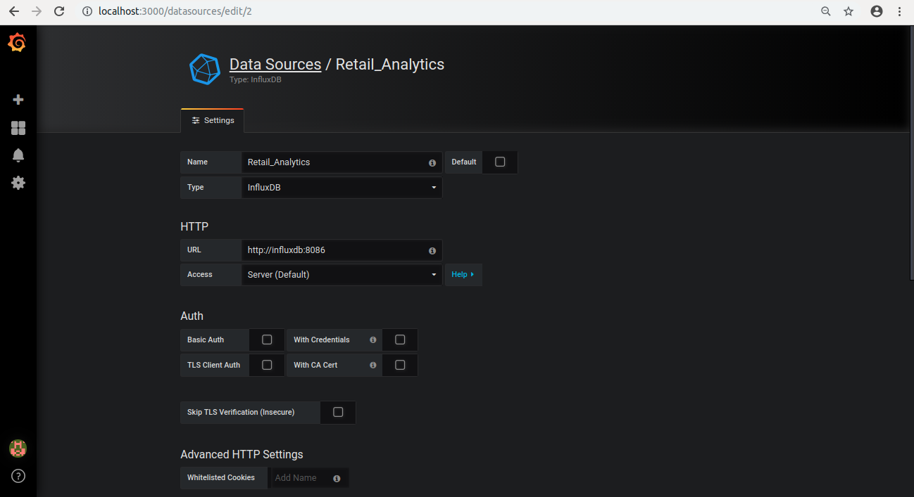
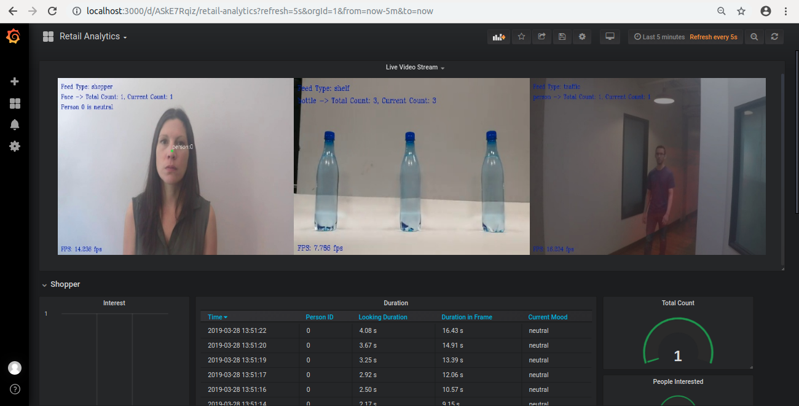

# Containerization 

## Install docker
To install docker, please refer the link: [https://docs.docker.com/install/linux/docker-ce/ubuntu/](https://docs.docker.com/install/linux/docker-ce/ubuntu/)<br>

### Install docker-compose
Install docker-compose using the commands below:
```
sudo curl -L "https://github.com/docker/compose/releases/download/1.24.0/docker-compose-$(uname -s)-$(uname -m)" -o /usr/local/bin/docker-compose
sudo chmod +x /usr/local/bin/docker-compose
```

## Containerize the Application
The application has three parts:
* OpenVINO application
* InfluxDB
* Grafana

Each part of the application will run in separate container.


To containerize the application:
1. Go to the smart-retail-analytics-python directory.

    ```
    cd <path_to_the_smart-retail-analytics-python_directory>
    ```
    
2. Build the docker image with the name __retail-analytics__.
    ```
    docker build -t retail-analytics -f docker/DockerOpenvino/Dockerfile .
    ```

3. To run the retail-analytics container with influxdb and grafana containers. Run the below command:
    ```
    docker-compose up
    ```
   * Docker Compose tool is used to define and run multi-container docker application

4. To see the output of the application running in the container, configure the Grafana dashboard.

	* In your browser, go to [localhost:3000](http://localhost:3000).

	* Log in with user as **admin** and password as **admin**.

	* Click on **Configuration**.

	* Select **“Data Sources”**.

	* Click on **“+ Add data source”** and provide inputs below.

	   - *Name*: Retail_Analytics
	   - *Type*: InfluxDB
	   - *URL*: http://influxdb:8086
	   - *Database*: Retail_Analytics
	   - Click on “Save and Test”

  	  

	* Click on **+** icon present on the left side of the browser, select **import**.

	* Click on **Upload.json File**.

	* Select the file name __retail-analytics.json__ from smart-retail-analytics-python directory.

	* Select "Retail_Analytics" in **Select a influxDB data source**. 

    	

	* Click on import.

    	
